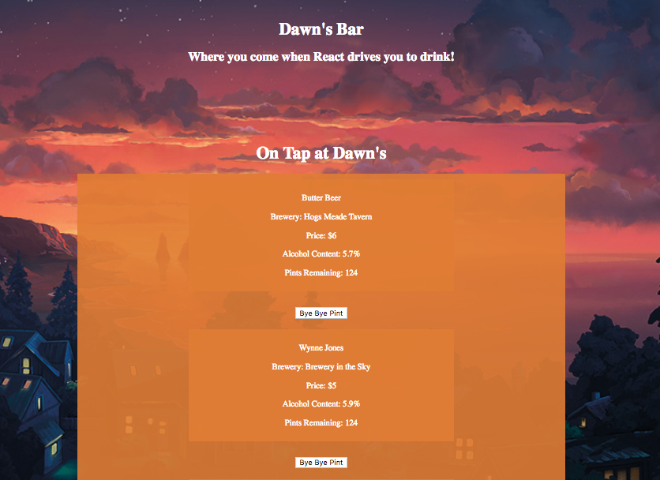
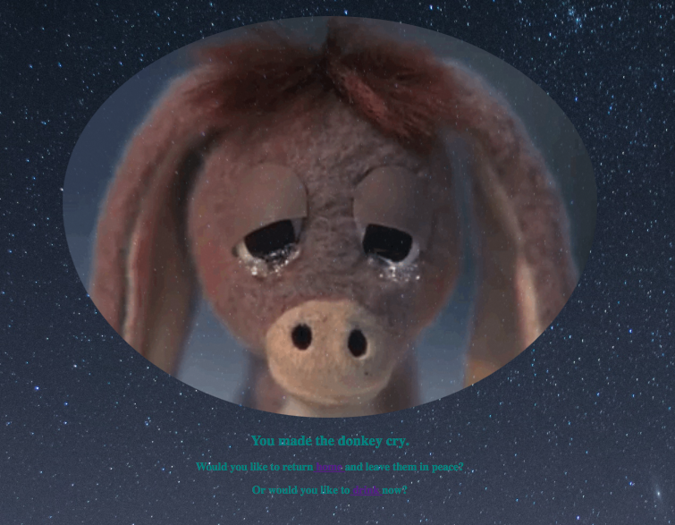

<!-- Twitter icon from https://github.com/carlsednaoui/gitsocial -->
[1.1]: http://i.imgur.com/tXSoThF.png (twitter icon with padding)
## Makeover: Tap Room Edition

#### _React Epicodus Code Review_
_React - Week 1 React Fundamentals: Tap Room Makeover_

Home page and drink list

Error 404 page

### Dawn Mott :sunrise_over_mountains:
_June 29th, 2018_

### Description
_This app showcases the features of a fictional taproom. Number of pints decreases by one with button click. _

### MVP Component Map

### Setup/Installation
clone this repository
 
run `npm install`
 
run `npm start`

### Requirements
MVP
* ~~List/menu of all available kegs~~
* ~~Keg - name, brand, price and alcohol content~~
* ~~404 error~~
* ~~button to decrease number of pints in keg~~

### Known Bugs

_There are many known :bug: at this time, this is a work in progress_

### Support and contact details

_If you'd like to chat, please contact_ @dawnrparty _on_ ![alt text][1.1]

### Technologies Used

_HTML, CSS, React, and flattery_

### License

*This page is licensed under the MIT license*

&copy; 2018 Dawn Mott :sunrise_over_mountains:
